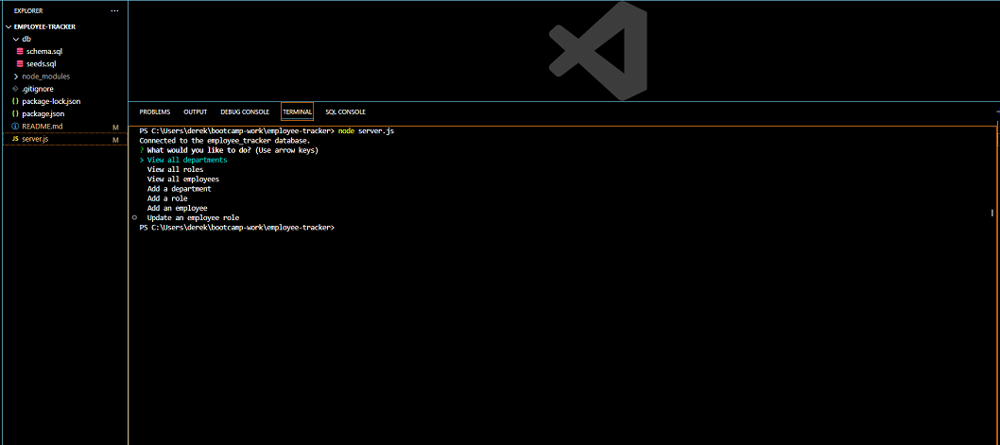

# Employee Database Tracker

## Description
This Node.js application facilitates the creation, reading, updating, and deleting of a database. It uses the third-party Node.js module called Inquirer which takes in user information and from that information effects the employee_tracker database. The app uses Inquirer's .prompt() method to stage a series of commands that the user can use to gain full control over employee information and can easily access and manage the data. The intuitive user interface provides a range of functionalities to ensure efficient handling of employee records. 

## Table of Contents
  * [Installation](#installation)
  * [Usage](#usage)
  * [License](#license)
  * [Contribute](#contributions)
  * [Tests](#tests)
  * [Questions?](#questions)

## Installation
Once the repository is cloned, from the root directory of where they installed the application the user is to run the command 'npm install' to install required dependencies. After dependencies are loaded, all the user must do to run the application is type 'node index.js' in the command line and answer the prompts as they appear.

## Usage
Click on the link below to see how to use the app on <a href="https://youtu.be/8K_BZI1PZng" target="_blank">YouTube</a>.

## License

## Contribute
Please feel free to contact me on my email or my github to contribute.

## Tests
No tests available at this time.

## Questions
Please reach out to me at derekmarchese1@gmail.com. 
Or check out my <a href="https://github.com/dtm589">GitHub</a>.